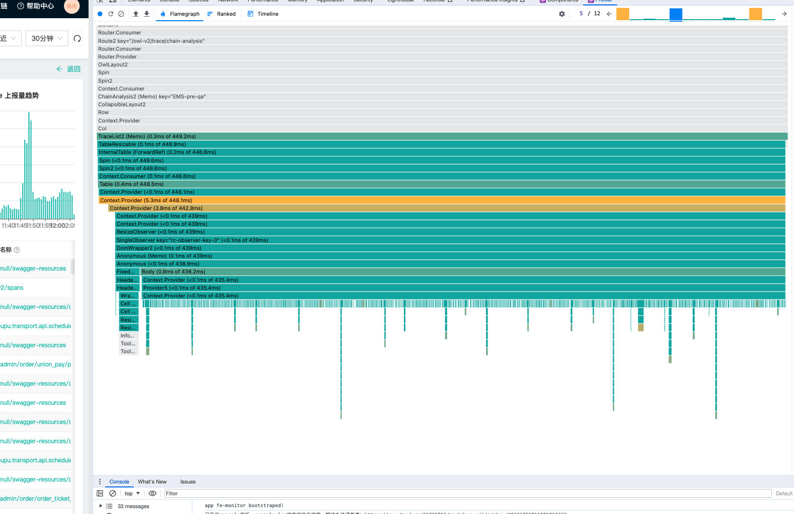
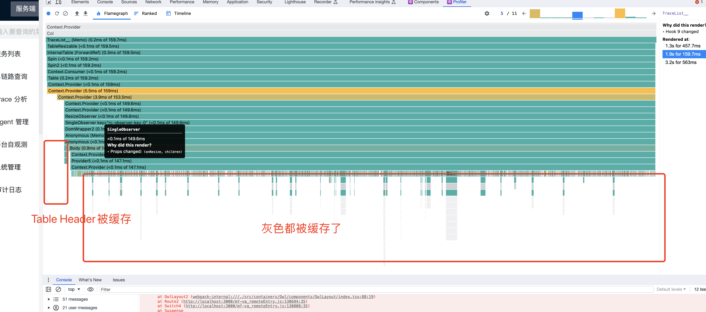
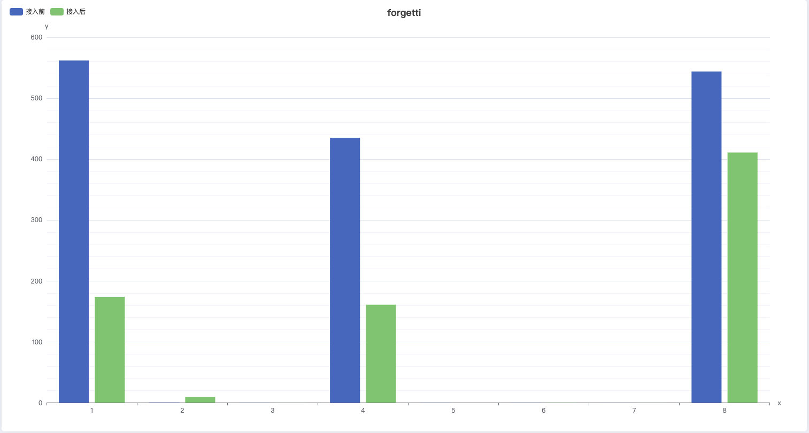

# React forgetti 

## 导读

Forgetti is an auto-memoization Babel plugin I made for a hook-based flow like React hooks.
This plugin was inspired by React Forget.（Forgetti是一个为函数组件自动缓存的babel插件，
灵感来自react forget）

react 性能优化一直是一个让开发者头疼的问题，随着版本迭代更新，业务代码需求变更，开
发者很难在优化的颗粒度做取舍，例如本人，没有感觉到卡，没有多调一次接口统一就是不用
优化(狗头)，写业务而已，又不是造轮子，而且大量的usexxx代码也会进一步增加代码的可读
性，增加其他人（包括自己）在理解代码上的心智负担。基于hooks的机制，很多刚接触的开
发者有时候总会很难想通，why rerender again? Why not re-render?优化真的好麻烦啊，但是
不优化对于一些场景的性能和用户体验又会大打折扣，出现莫名其妙的刷新、闪屏、卡顿等，
要是有一种能够自动memo所有东西就好了。

大概两年前[React Conf2021]团队第一次介绍了react forget这个插件，这个可以自动生成
memo的官方版编译器，一经宣传，React forget就收到大量的关注，不论是视频的播放量还
是黄玄大佬的人气，使该视频播放量一度在当期榜首，然而两年过去了，黄玄也离开了React
团队，那React forget真的凉了吗，答案是没有，React forget一直都在React的[工作安排]
中，前几天在[React conf2023 London]上，官方也表示没有放弃React forget，这几年一直都
在继续研究并投入到部分生产环境上，需要一些时间的验证再向社区开源，此时一位大佬
(solidjs 社区成员)表示坐不住了，终于在今年三月份发布了社区版react forget， 他有着和
react forget 一样的核心原理和效果。


## 收益

接下来我们在Owl项目中进行测试【目前四五个页面已上生产】，不对代码做任何改动，对比
下接入和未接入forgetti的react更新状态下的性能分析报告和渲染时间。

我们在[Owl]一个比较复杂的表单搜索页面中接入, 在右上角的做相同的刷新操作， 对比下使用
前和使用后的差异, 仅对update状态查看优化效果.

### React Profiler devTool

基于相同操作，我们使用react dev tool Perfiler去查看对应的优化结果(同一次操作&同一次
commit)：

###### 优化前

###### 优化后



我们先不探讨为什么第一次和第三次优化没有生效，也可能涉及业务代码等其他情况。由

react性能分析工具可以看出，TraceList组件update时，其中TraceList组件刷新第二次
forgetti后commit由449ms的redner耗时优化指159.7ms的耗时，性能提升至 2 倍+，底部
部分组件完全被缓存，图中被红框框住的部分。

### React Profiler api
[React Profiler API] 会分析渲染和渲染成本，以帮助识别应用程序中卡顿的原因。

Profiler 接受一个 onRender 回调函数，当被分析的渲染树中的组件提交更新时，就会调用它。

基于相同操作，我们使用actualDuration参数查看当前组件和子组件上每次update时真实花
费的时间。



###### 点击刷新按钮触发的八次更新， 可以看到，三次比较耗时的更新对应了上面性能分析的三次

大的update消耗。

###### 优化前：

```
<Profiler
id="chainAnalysis"
onRender={(id, phase, actualDuration, baseDuration,
startTime, commitTime) => {
console.log(id, actualDuration);
}}
>
<CollapsibleLayout />
/**
* xxxx
* **/
</Profiler>
```

###### 优化后:

###### 可以看到，每次复杂度高的更新场景，时间消耗几乎综合减少了两倍左右。

### UX

###### 接入前

屏幕录制 2023 - 11 - 13 17.56.03.mov

可以看到，随着表格数据的刷新，我们的图表组件也在闪烁，因为图表组件没有使用memo

等api缓存参数，导致有些与图表无关参数在每次渲染的时候变化了，近一步影响了图表的，

从而触发了图表组件rerender。

###### 接入后:

屏幕录制 2023 - 11 - 13 18.01.05.mov

```
chainAnalysis 562.
chainAnalysis 0.
chainAnalysis 0.
chainAnalysis 435.
chainAnalysis 0.
chainAnalysis 0.
chainAnalysis 0.
chainAnalysis 544.
```
```
chainAnalysis 174.
chainAnalysis 0.
chainAnalysis 0.
chainAnalysis 161.
chainAnalysis 0
chainAnalysis 0.
chainAnalysis 0.
chainAnalysis 411.
```

###### 我们可以很明显的看到，图表数据在没有任何变化的情况下，伴随着其他数据状态改变并不会

###### 造成图表的重新渲染。

以上优化仅次于使用者不了解forgetti的情况下，如果在代码中仅仅只是一些小改动，可以优
化到更好，那么有什么做法可以让代码更auto memo呢，我们不妨试着更深入forgetti。

## forgetti 解析

###### 思维导图


### 编译后Demo

ToDoList

forgetti-demo - CodeSandbox

核心原理： 编译期间使用数组缓存所有能缓存的东西。对jsx缓存根据依赖生成auto memo
组件，如果刷新期间依赖没变化继续使用上一次的函数缓存，否则使用最新值，减少视图层更
新。基于缓存的优化上再将react hooks抹去。

总结： auto memo everything。

#### 编译前


#### 编译后

###### 每个组件都会初始化一个用来存储当前组件所有状态的数组，每个数组都会定义一个当前下标

的_equalsx来判断是否变化进而在当前更新时走缓存，所以每次表达式或者变量定义赋值语句
先判定是否能缓存，如果函数依赖没变化，则该函数能走缓存。

每一个申明的表达式或者变量都会至少多出两行代码，一行赋值isEquals判断与上一次缓存是
否相等，一行赋值_vlaue表达式初始化或者用已记录的缓存值。

函数自动添加useCallback特性

```
const App = ({a}) => {
const [done, setDone] = useState(false);
const fn = () => {
console.log(done)
}
return <div onClick={fn}>{a} - {done? 'finish' :
'doing'}</div>
}
```

### runtime

##### 运行时提供的api大部分都是为了适配react和preact两个框架多出的runtime，例如

 $$memo就是react的memo，在preact中同理。

 $$cache： 调用不同runtime的缓存api创建数组。

 $$equals: 判断cache中某个下标是否与其相等。

 $$branch: 在cache的基础上对某个下标派发一个分支存储(例如if判断、循环遍历， 一个

```
cache中都会衍生出多个分支存储对应的分支依赖)。
```
### 优化步骤

#### 函数内联展开[前置] pre-inlining

###### 将只用到一次且在组件函数体内定义的表达式会移至函数调用处


###### // 优化前

function Example(props) {

function a () {}

useEffect(a, [])

const b = props.a + 1

return <div>{b}</div>

}

// 优化后

function Example (props) {

useEffect(function a () {}, []);

return <div>{props.a + 1}</div>

}


#### 简化代码 Simplification

各种类型自动转boolean

源码位置


function getBooleanishState(node: t.Expression): LiteralState {

switch (node.type) {

case 'BooleanLiteral':

return node.value? 'truthy' : 'falsy';

case 'NumericLiteral':

return node.value === 0? 'falsy' : 'truthy';

case 'NullLiteral':

return 'nullish';

case 'StringLiteral':

return node.value === ''? 'falsy' : 'truthy';

case 'BigIntLiteral':

return node.value === '0'? 'falsy' : 'truthy';

case 'Identifier': {

switch (node.name) {

case 'NaN':

return 'falsy';

case 'undefined':

return 'nullish';

case 'Infinity':

return 'truthy';

default:

return 'indeterminate';

}

}

case 'ParenthesizedExpression':

case 'TypeCastExpression':

case 'TSAsExpression':

case 'TSSatisfiesExpression':

case 'TSNonNullExpression':

case 'TSTypeAssertion':

case 'TSInstantiationExpression':

return getBooleanishState(node.expression);

default:

return 'indeterminate';

}

}


##### 三元表达式简化

##### 二元表达式优化

###### 位置

###### 同上，核心也是通过查看对应的类型返回的真假进行去除不需要的代码

```
// in
export default function Test(props) {
const a = !1? false : true
return 1
};
// out
function Test(props) { const a = true; return 1;}
```

##### 一元表达式简化

###### 源码位置

###### 也称先序， 顾名思义， 在表达式中级别最高的计算

###### +=， - =! ...

目前仅针对void !这两种先序的情况进行处理

void 后跟的任何 都为 undefined

```
// in
export default function Test(props) {
const a = !1 || true
return 1
};
// out
function Test(props) { const a = true; return 1;}
```

其他的简化表达式没啥可讲的， 都是很难碰上的一些小优化， 还有while等需要判定的场景

#### 展开 Expanding

###### 源码位置

###### 核心是将所有的复杂代码情况简单化，方便后续缓存处理： 如可选链调用，可选链函数执

###### 行，同一行多个赋值语句，需要进一步展开后统一走缓存。

##### 函数执行可选链转换

###### 位置

###### 当遇到动态参数传递的时候， 使用可选链函数调用时， 需要走一步转换，转换为三元表达式

###### 处理，如:

```
// in
function Test(props) {
if(!0) {
return 1
}
return 2
};
// out
function (props) { { return 1; } return 2;}
```

##### 赋值语句转换

###### 生成缓存变量存储已有变量

位置： AssignmentExpression

```
function Example(props) {
return props?.a?.b?.c;
}
// 展开后
function Example(props) {
let _nullish, _nullish2;
let _hoisted2 = _nullish2 = props == null? void 0 : props.a;
let _hoisted = _nullish = _hoisted2 == null? void 0 :
_nullish2.b;
return _hoisted == null? void 0 : _nullish.c;
}
```

##### JSX 静态节点缓存

针对于编译后的jsx代码， forgetti会再次使用静态节点标记， 类似vue3中编译的优化效果那
样，不依赖于当前状态的jsx节点会被缓存，对于静态节点多的情况下，此类的优化效果极
大。

相似优化插件也可以查看million.js, 这个号称能让react应用快百分之 70 的编译时virtual
dom， 核心原理都是一致的，基于编译区分静态节点，让静态节点永远只渲染一次。

```
// input
function Example(props) {
const a = <div>{props.a}</div>;
const getB = () => <div>{props.b}</div>;
return <div>{props.a}: {getB()}
{
xx.map()
}</div>;
}
```
```
// output
const _Memo = _$$memo(_memo, _values => <div>{_values[0]}</div>),
_Memo2 = _$$memo(_memo, _values2 => <div>{_values2[0]}:
{_values2[1]}</div>),
_Memo3 = _$$memo(_memo, _values3 => <div>{_values3[0]}</div>);
function Example(props) {
const a = /*@forgetti jsx*/<_Memo v={[props.a]} />;
return (/*@forgetti jsx*/<_Memo2 v={[props.a, (() =>
/*@forgetti jsx*/<_Memo3 v={[props.b]} />)()]} />);
}
```

// input

export default memo(function Test(props) {

return /*#__PURE__*/_jsxs("div", {

children: [props.a, /*#__PURE__*/_jsx("div", {

children: "1"

}), /*#__PURE__*/_jsx("div", {

children: "2"

})]

});

});

// output:

export default memo(function (props) {

let _cache = _$$cache(_useMemo, 10),

_value = 0 in _cache? _cache[0] : _cache[0] = _jsxs,

_equals = _$$equals(_cache, 1, props),

_value2 = _equals? _cache[1] : _cache[1] = props,

_value3 = _equals? _cache[2] : _cache[2] = _value2.a,

_equals2 = _$$equals(_cache, 3, _value3),

_value4 = _equals2? _cache[3] : _cache[3] = _value3,

_value5 = 4 in _cache? _cache[4] : _cache[4] =

/*#__PURE__*/_jsx("div", {

children: "1"

}),

_value6 = 5 in _cache? _cache[5] : _cache[5] =

/*#__PURE__*/_jsx("div", {

children: "2"

}),

_value7 = _equals2? _cache[6] : _cache[6] = [_value4,

_value5, _value6],

_value8 = _equals2? _cache[7] : _cache[7] = {

children: _value

},

_equals3 = _$$equals(_cache, 8, _value8),

_value9 = _equals3? _cache[8] : _cache[8] = _value8;

return _equals3? _cache[9] : _cache[9] =

/*#__PURE__*/_value("div", _value9);

});


#### 缓存 Memoization

###### 源码位置

##### 依赖关系

依赖是一个表达式他所引用的参数的关系。Forgetti会对这些值进行优化，以标记依赖值是否
发生了变化。除了记忆化步骤之外 value =，还会生成一个用于检查条件的变量 _isequlsx。

如果一个表达式有一个或多个依赖项，那么由这些依赖项产生的条件会被合并，使得依赖值将
合并后的条件作为自己的条件。如果条件为false，那么依赖值会生成自己的新值。这个过程类
似于useMemo，但不需要依赖列表的依赖项。

##### 常量

如果一个表达式没有任何依赖,将会被缓存，效果就像是使用了useRef。

```
function Example(props) {
const message = `${props.greeting}, ${props.message}`;
}
// Compiles into
import { useRef as _useRef } from "react";
import { $$cache as _$$cache } from "forgetti/runtime";
import { $$equals as _$$equals } from "forgetti/runtime";
function Example(props) {
let _cache = _$$cache(_useRef, 6),
_equals = _$$equals(_cache, 0, props),
_value = _equals? _cache[0] : _cache[0] = props,
_value2 = _equals? _cache[1] : _cache[1] = _value.greeting,
_equals2 = _$$equals(_cache, 2, _value2),
_value3 = _equals2? _cache[2] : _cache[2] = _value2,
_value4 = _equals? _cache[3] : _cache[3] = _value.message,
_equals3 = _$$equals(_cache, 4, _value4),
_value5 = _equals3? _cache[4] : _cache[4] = _value4;
const message = _equals2 && _equals3? _cache[5] : _cache[5] =
`${_value3}, ${_value5}`;
}
```

###### 完全恒定的复杂表达式被缓存为一个。

```
function Example() {
const value = [1, 2, 3, 4];
}
// Compiles into
import { useRef as _useRef } from "react";
import { $$cache as _$$cache } from "forgetti/runtime";
function Example() {
let _cache = _$$cache(_useRef, 1);
const value = 0 in _cache? _cache[0] : _cache[0] = [1, 2, 3,
4];
}
```

##### 函数

##### 所有在组件内的函数都会自动加上auto-memoized的特性，如果函数的依赖没有变化函数

##### 就还是之前的函数。

```
function Example() {
const greeting = getGreeting();
const receiver = getReceiver();
const message = `${greeting}, ${receiver}`;
}
// Compiles into
import { useRef as _useRef } from "react";
import { $$cache as _$$cache } from "forgetti/runtime";
function Example() {
let _cache = _$$cache(_useRef, 1);
const message = 0 in _cache? _cache[0] : _cache[0] =
`${getGreeting()}, ${getReceiver()}`;
}
```

##### loop

循环优化也是利用分支$$branch产生一个分支数组，但循环与普通分支有点不同，因为普通分

支的大小是静态的：分支的数量不会改变。循环在分支中是动态的，它可以在满足条件时重新计算

多次，因此需要执行一个额外的步骤。 forgetti 在循环之外生成分支缓存，以及另一个跟踪其大小

的变量。该变量用于索引循环内生成的内部分支缓存。

支持以下几种:

 for

 for-of

 for-in

 while

```
function Example(props) {
const value = props.condition? props.left : props.right;
}
// Compiles into
import { useRef as _useRef } from "react";
import { $$cache as _$$cache } from "forgetti/runtime";
import { $$branch as _$$branch } from "forgetti/runtime";
import { $$equals as _$$equals } from "forgetti/runtime";
function Example(props) {
let _cache = _$$cache(_useRef, 4),
_equals = _$$equals(_cache, 0, props),
_value2 = _equals? _cache[0] : _cache[0] = props,
_value;
if (_equals? _cache[1] : _cache[1] = _value2.condition) {
let _cache2 = _$$branch(_cache, 2, 2),
_equals2 = _$$equals(_cache2, 0, props),
_value4 = _equals2? _cache2[0] : _cache2[0] = props;
_value = _equals2? _cache2[1] : _cache2[1] = _value4.left;
} else {
let _cache3 = _$$branch(_cache, 3, 2),
_equals3 = _$$equals(_cache3, 0, props),
_value6 = _equals3? _cache3[0] : _cache3[0] = props;
_value = _equals3? _cache3[1] : _cache3[1] = _value6.right;
}
const value = _value;
}
```

 do-while

#### Hooks

感谢另一位社区开源大佬(SukkaW), 基于以上优化适配了hooks抹除,接下来我们来看看大佬是
如何抹去常用的react hooks的。

##### ref

useRef会被直接缓存成数组下的某一项。

```
function Example(props) {
for (const x in props.arr) {
console.log(x);
}
const fn = useCallback (() => {
console.log(props.a)
}, [props.a] )
// Compiles into
import { useRef as _useRef } from "react";
import { $$cache as _$$cache } from "forgetti/runtime";
import { $$branch as _$$branch } from "forgetti/runtime";
import { $$equals as _$$equals } from "forgetti/runtime";
function Example(props) {
let _cache = _$$cache(_useRef, 3),
_equals = _$$equals(_cache, 0, props),
_value = _equals? _cache[0] : _cache[0] = props,
_value2 = _equals? _cache[1] : _cache[1] = _value.arr,
_cache2 = _$$branch(_cache, 2, 0), // cache loop
_id = 0;
for (const x in _value2) {
let _loop = _$$branch(_cache2, _id++, 2), // 利用运行时下标_id
动态缓存当前作用域内的变量
_equals2 = _$$equals(_loop, 0, x),
_value3 = _equals2? _loop[0] : _loop[0] = x;
_equals2? _loop[1] : _loop[1] = console.log(_value3);
}
}
```

##### memo callback

useMemo和useCallBack api会被直接抹去

```
import { useRef } from 'react';
```
```
function Example(props) {
const example = useRef(initialValue);
}
// Compiles into
import { useRef as _useRef } from "react";
import { $$cache as _$$cache } from "forgetti/runtime";
import { useRef } from 'react';
function Example(props) {
let _cache = _$$cache(_useRef, 1);
const example = 0 in _cache? _cache[0] : _cache[0] = {
current: initialValue
};
}
```

这样一套操作下来最最常用的hooks就没了，表面上看起来只是少了一个钩子调用，实际上少
了react内部n多机制的代码运行。

useMemo同理，只是多个函数执行

```
q = useCallBack(() => {xxx}, [a,b])
替换为
q = _equalsa & _equalsb? _cache[q] : () => {xxx}
```
```
q = useMemo(() => { return a+ b}, [a,b])
替换为
q = _equalsa & _equalsb? _cache[q] : (() => { return a+ b})()
```

#### Post-Inline

###### 对优化后的代码再次进行内联操作

```
import { useEffect } from 'react';
```
```
function Example(props) {
useEffect(() => {
getValue(props.a, props.b, props.c);
}, [props.a, props.b, props.c]);
}
// Compiles into
import { useRef as _useRef } from "react";
import { $$cache as _$$cache } from "forgetti/runtime";
import { $$equals as _$$equals } from "forgetti/runtime";
import { useEffect } from 'react';
function Example(props) {
let _cache = _$$cache(_useRef, 9),
_equals = _$$equals(_cache, 0, props),
_value = _equals? _cache[0] : _cache[0] = props,
_value2 = _equals? _cache[1] : _cache[1] = _value.a,
_equals2 = _$$equals(_cache, 2, _value2),
_value3 = _equals2? _cache[2] : _cache[2] = _value2,
_value4 = _equals? _cache[3] : _cache[3] = _value.b,
_equals3 = _$$equals(_cache, 4, _value4),
_value5 = _equals3? _cache[4] : _cache[4] = _value4,
_value6 = _equals? _cache[5] : _cache[5] = _value.c,
_equals4 = _$$equals(_cache, 6, _value6),
_value7 = _equals4? _cache[6] : _cache[6] = _value6,
_hoisted = useEffect(() => {
getValue(props.a, props.b, props.c);
}, [_equals2 && _equals3 && _equals4? _cache[7] : _cache[7]
= [_value3, _value5, _value7]]);
_$$equals(_cache, 8, _hoisted)? _cache[8] : _cache[8] =
_hoisted;
}
```

### todo & Bug

#### 可配置跳过表达式缓存

上文我们提到了他会缓存所有表达式，所以当我们全局开启forgetti（不建议）的时候，
console、debug、Math.random()此类具有mutabili特性的api会在组件重新渲染的时候被缓
存导致不执行，相关issue

所以作者希望通过一个颗粒化较细的配置去判断是否跳过指定的api。

可以在缓存所有表达式前增加判断是否是api调用且调用的方法名称是否是不需要缓存的。最
简实现。

与当前sytle9 写法冲突，当使用style9 jsx内嵌入css参数时，会报错，有可能这个feature完
成了就可以解决这个问题了

#### dev环境中支持sourceMap

这个强烈建议，为了保证多个环境同样的效果和良好的开发者体验，不然dev环境debug的
时候都是一堆判断。


#### 对象中包含三元表达式未追踪依赖

###### 目前的编译器中， 对象中的三元表达式的编译没做收集依赖， 导致每次刷新视图都是第一次

的状态。已提pr-> 已merge -> 已升级forgetti-loader。有兴趣可以看看 issue地址 和 bug记
录

### 相关链接

```
// input
export default memo(function Test(props) {
const b = {
a: props.a? 2 : 1
}
return <div>{b.a}</div>
});
// output
export default memo(function (props) {
let _cache = _$$cache(_useMemo, 6),
_equals = _$$equals(_cache, 0, props),
_value2 = _equals? _cache[0] : _cache[0] = props,
_value;
if (_equals? _cache[1] : _cache[1] = _value2.a) {
_value = 2;
} else {
_value = 1;
}
let _value4 = 2 in _cache? _cache[2] : _cache[2] = {
a: _value
},
_value5 = 3 in _cache? _cache[3] : _cache[3] = _value4.a,
_value6 = 4 in _cache? _cache[4] : _cache[4] = [_value5];
return 5 in _cache? _cache[5] : _cache[5] = /*@forgetti
jsx*/<_Memo v={_value6} />;
});
```

forgetti

forget-loader

部分源码注释

fb 内部对react forget的回答

react conf - forget 2021

React conf2023 London

million.js


