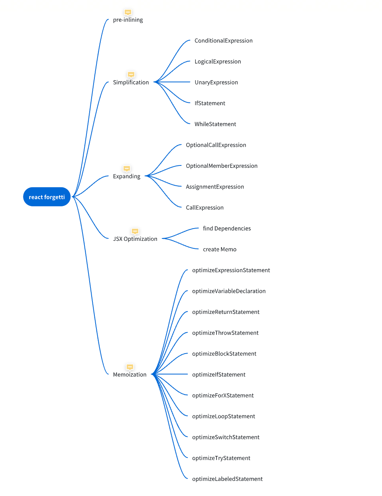

# forgetti 解析

Forgetti is an auto-memoization Babel plugin I made for a hook-based flow like React hooks. This plugin was inspired by React Forget.（Forgetti是一个为函数组件自动缓存的babel插件， 灵感来自react forget）

优化的最终还是编译

# 导读

react 性能优化一直是一个让开发者头疼的问题，随着版本迭代更新，业务代码需求变更，开发者很难在优化的颗粒度做取舍，例如本人，没有感觉到卡，没有多调一次API统一就是不用优化(狗头)，写写业务而已，优化的时候都够我完成几个小需求了

[思维导图](https://yeqv9nxxyj.feishu.cn/docx/V9AzdnfnCoxLYOxyCkBcCouhnRh)



## 编译后Demo

ToDoList：
<https://codesandbox.io/s/forgetti-demo-h552p6?file=/src/DemoTodo/forgetIndex.jsx>

核心原理： 编译期间使用数组缓存所有表达式，变量，jsx。劫持组件render，生成HOC组件，HOC内部处理缓存操作，缓存函数和jsx时，内部获取所有相关依赖，如果依赖没变化继续使用上一次的函数缓存，减少视图层更新。
总结： auto memo

### 编译前

```jsx
const App = ({a}) => {
  const [done, setDone] = useState(false);
  console.log(done)
  return <div>{a} - {done ? 'finish' : 'doing'}</div>
}
```

### 编译后

为每次表达式或者变量定义赋值语句先判定是否能缓存，如果函数依赖没变化，则该函数能走缓存。
每一个申明的表达式或者变量都会多出两行代码，一行判断与上一次缓存是否相等，一行二元表达式初始化或者用原始值。

```jsx
// 注入运行时和依赖api 
import { useMemo as _useMemo } from "react";
import { $$cache as _$$cache } from "forgetti/runtime";
import { $$equals as _$$equals } from "forgetti/runtime";
import { memo as _memo } from "react";
import { $$memo as _$$memo } from "forgetti/runtime";

// 生成HOC组件，自动为组件添加memo操作
const _Memo = _$$memo(_memo, _values => <div>{_values[0]} - {_values[1]}</div>);

const App = ({
  a
}) => {
  let _cache = _$$cache(_useMemo, 7); // 初始化缓存数组， 根据索引对下面的表达式｜变量定义｜函数 进行缓存
  const [done, setDone] = useState(false); // set 函数没有被用到，直接忽略
  let _equals = _$$equals(_cache, 0, done),  // 首次执行时必为false
    _value = _equals ? _cache[0] : _cache[0] = done; // 映射done变量， 相等优先使用缓存，否则替换最新的缓存结果
  _equals ? _cache[1] : _cache[1] = console.log(_value); // console这里作为函数处理，哪怕没有变量接收返回值，也做了一次缓存， console 依赖了done ，done是否被缓存来源于_equals，如果为true就不需要更新，直接使用上一次的缓存，所以这对于业务来说是bug，会导致第一次打印，第二次以后都不会执行了，正常应该直接替换依赖缓存不做cache即可，即 console.log(_value);不用走缓存，本就没有返回值
  /**
  * jsx内行内表达式和表达式缓存 
  */
  let _equals2 = _$$equals(_cache, 2, a), // 判断a是否被缓存， 首次都是false
    _value3 = _equals2 ? _cache[2] : _cache[2] = a, // 首次执行赋值， 刷新时优先使用缓存
    _value4; // 二元表达式结果
  if (_value) {
    _value4 = 'finish';
  } else {
    _value4 = 'doing';
  }
  let _equals3 = _$$equals(_cache, 3, _value4),  // 判断二元表达式结果是否相等
    _value5 = _equals3 ? _cache[3] : _cache[3] = _value4, // 二元表达式缓存
    /** jsx编译走的也是函数那一套处理方式， 找出jsx渲染对应的依赖，如果当前返回的节点依赖都没变化，那么就也可以使用缓存， jsx当前依赖了a和done,他们对应的是_equals2和_equals3 */ 
    _value6 = _equals2 && _equals3 ? _cache[4] : _cache[4] = [_value3, _value5],
    _equals5 = _$$equals(_cache, 5, _value6), // 判断jsx能不能使用缓存， 依赖都一致下就可以使用
    _value7 = _equals5 ? _cache[5] : _cache[5] = _value6; // jsx依赖一致的话就可以直接使用缓存，否则降级再走一次memo判断下是否能够缓存，实在不一致时刷新组件渲染
  return _equals5 ? _cache[6] : _cache[6] = /*@forgetti jsx*/<_Memo v={_value7} />;
};

```

## 优化步骤

### 函数内联展开[前置] pre-inlining

将只用到一次且在组件函数体内定义的表达式会移至函数调用处

```js
//  优化前

function Example(props) {
  function a () {}
useEffect(a, [])
const b = props.a + 1
return <div>{b}</div>
}
//  优化后
function Example (props) {
useEffect(function a () {}, [])
return <div>{props.a + 1}</div>
}
```

```ts
export function inlineExpressions(
  path: babel.NodePath<ComponentNode>,
): void {
  path.traverse({
    Expression(p) {
       // 在当前函数作用域下 并且是标识符(理解为变量名)
      if (p.getFunctionParent() === path && isPathValid(p, t.isIdentifier)) {
        const binding = p.scope.getBinding(p.node.name);
        // 检查标识符是否被引用过，并且只被引用了一次。
        if (binding && binding.referenced && binding.referencePaths.length === 1) {
          switch (binding.kind) {
            case 'const':
            case 'let':
            case 'var': {
              // move the node to the reference
              const ref = binding.referencePaths[0];
              if (
                isInValidExpression(ref)
                && isPathValid(binding.path, t.isVariableDeclarator)
                && binding.path.node.init
                && isPathValid(binding.path.get('id'), t.isIdentifier)
                && binding.path.scope.getBlockParent() === ref.scope.getBlockParent()
              ) { //  满足以上条件将原来的函数替换
                ref.replaceWith(binding.path.node.init);
                binding.path.remove();
              }
            }
              break;
            default:
              break;
          }
        }
      }
    },
  });
  path.scope.crawl();
}
```

input:

```jsx
props => {  const [a, setA] = useChencc(1);  const [b, setB] = useState(1);  const c = function () {    console.log(a);  };  test(c);  useEffect(() => {}, [b]);  return <div onClick={() => {    console.log(props);    setA(2);  }}>123</div>;}
```

output:

```jsx
props => {  const [a, setA] = useChencc(1);  const [b, setB] = useState(1);  test(function () {    console.log(a);  });  useEffect(() => {}, [b]);  return <div onClick={() => {    console.log(props);    setA(2);  }}>123</div>;}
```

### 简化代码 Simplification

#### 条件表达式简化

各种类型自动转boolean

```ts
   ConditionalExpression: {
      exit(p) {
        // 根据原有类型的值进行转换， 如0 转为false , 详情查看getBooleanishState函数
        const state = getBooleanishState(p.node.test);
        if (state === 'truthy') {
          // 直接替换真值对应的表达式
          p.replaceWith(p.node.consequent);
        } else if (state !== 'indeterminate') {
          // 直接替换假值对应的表达式
          p.replaceWith(p.node.alternate);
        }
      },
    },
```

#### 逻辑表达式优化

同上，核心也是通过查看对应的类型返回的真假进行去除不需要的代码

```ts
  LogicalExpression: {
      exit(p) {
      // 获取结果
        switch (getBooleanishState(p.node.left)) {
          case 'nullish':
          // null undefinded   和?? 关系 处理
            p.replaceWith(p.node.operator === '??' ? p.node.right : p.node.left);
            break;
          case 'falsy':
          //  假 和 或关系 => 处理

            p.replaceWith(p.node.operator === '||' ? p.node.right : p.node.left);
            break;
          case 'truthy':
            // 真 和&& 关系处理
            p.replaceWith(p.node.operator === '&&' ? p.node.right : p.node.left);
            break;
          default:
            break;
        }
      },
    },
```

#### 一元表达式简化

也称先序， 顾名思义， 在表达式中级别最高的计算
+=， -= !1  ...
目前仅针对void !这两种先序的情况进行处理

```ts
    UnaryExpression: {
      exit(p) {
        const state = getBooleanishState(p.node.argument);
        switch (p.node.operator) {
          case 'void': // void后不论跟啥直接转换为undefined ， 在某些场景会有问题
            if (state !== 'indeterminate') {
              p.replaceWith(t.identifier('undefined'));
            }
            break;
          case '!': // 对表达式直接取反出结果, !0 先对0进行转换为false，在这里直接转换为true  
            if (state === 'truthy') {
              p.replaceWith(t.booleanLiteral(false));
            } else if (state !== 'indeterminate') {
              p.replaceWith(t.booleanLiteral(true));
            }
            break;
          default:
            break;
        }
      },
    },
```

#### if条件语句

同理，对条件进行最终求值后再次优化

```ts
   IfStatement: {
      exit(p) {
        const state = getBooleanishState(p.node.test);
        if (state === 'truthy') { // 如果条件内为true， 直接去除if
          p.replaceWith(p.node.consequent);
        } else if (state === 'indeterminate') { // 不明确啥也不做
          // TODO Should simplify IfStatement?
        } else if (p.node.alternate) { // 走到这里就是不满足的情况，即if(false){}, 所以直接替换else中的内容
          p.replaceWith(p.node.alternate);
        } else {
          p.remove();
        }
      },
    },
```

其他的简化表达式没啥可讲的， 都是很难碰上的一些小优化， 还有while

### 展开 Expanding

 核心是将所有的复杂代码情况简单化，方便后续缓存处理： 如可选链调用，可选链函数执行，同一行多个赋值语句，需要进一步优化后统一走缓存。

#### 函数执行可选链转换

当遇到动态参数传递的时候， 使用可选链函数调用时， 需要走一步转换，转换为三元表达式处理，如:

```js
function Example (props) { // 让编译阶段能够更好的优化，手动做一层转换
  return props.a?.(props.b, props.b);
}

function Example(props) {  let _nullish;  let _hoisted = _nullish = props.a;  return _hoisted == null ? void 0 : _nullish.call(props, props.b, props.c);}
```

```js
function transformOptionalCall(path: babel.NodePath<t.OptionalCallExpression>): t.Expression {
  const unwrappedID = unwrapNode(path.node.callee, t.isIdentifier);
  if (unwrappedID) { // 如果是定义的函数， 感觉没多大意义， 对一个已经定义的函数加可选链，这里也做了适配。
    return t.conditionalExpression( // 创建一个三元表达式
      t.binaryExpression( // 包一个二元表达式 unwrappedID == null;
        '==', // 一整句三元表达式为 unwrappedID == null ? void 0 : unwrappedID.call(xxx,xxx);
        unwrappedID,
        t.nullLiteral(),
      ),
      UNDEFINED_LITERAL,
      t.callExpression(
        unwrappedID,
        path.node.arguments,
      ),
    );
  }// 如果不是定义的参数，例如：外部传入，或者其他模块引入等
  const temp = path.scope.generateUidIdentifier('nullish'); // 创建一个临时变量
  path.scope.push({ // 生成变量定义语句 let nullish
    kind: 'let',
    id: temp,
  });
  const unwrappedCallee = unwrapNode(path.node.callee, t.isMemberExpression)
    || unwrapNode(path.node.callee, t.isOptionalMemberExpression);
  if (unwrappedCallee) {
    let unwrappedObject = unwrapNode(unwrappedCallee.object, t.isIdentifier);
    if (!unwrappedObject) { // 如果是b?.()
      unwrappedObject = path.scope.generateUidIdentifier('object');
      path.scope.push({
        kind: 'let',
        id: unwrappedObject,
      });
      unwrappedCallee.object = t.assignmentExpression('=', unwrappedObject, unwrappedCallee.object);
    } // 如果是a.b?.()
    return t.conditionalExpression(
      t.binaryExpression( //  _hoisted == null ? void 0 : _nullish.call(props, props.b, props.c)
        '==',
        t.assignmentExpression('=', temp, unwrappedCallee), // 生成赋值语句  nullish = a.b
        t.nullLiteral(),
      ),
      UNDEFINED_LITERAL,
      t.callExpression(
        t.memberExpression(temp, t.identifier('call')),
        [unwrappedObject, ...path.node.arguments],
      ),
    );
  }
}
```

#### 变量调用可选链转换

处理当变量中包含可选链的多级调用。核心处理也是同上，走代码转换
源码位置:  expand-expression.ts ->  transformOptionalMember

```js
function Example(props) {
  return props?.a?.b?.c;
}
// 展开后
function Example(props) {  let _nullish, _nullish2;  let _hoisted2 = _nullish2 = props == null ? void 0 : props.a;  let _hoisted = _nullish = _hoisted2 == null ? void 0 : _nullish2.b;  return _hoisted == null ? void 0 : _nullish.c;}
```

#### 赋值语句转换

生成缓存变量存储已有变量

```js
function Example(props) {  let a, b, c;  a = b = c = props.x;}
// 展开后
function Example(props) {  let a, b, c;  let _hoisted2 = c = props.x;  let _hoisted = b = _hoisted2;  a = _hoisted;}
```

```js
 const id = p.scope.generateUidIdentifier('hoisted'); // 生成缓存不重复变量
        statement.insertBefore( // 在赋值语句前插入定义的变量
          t.variableDeclaration(
            'let',
            [t.variableDeclarator(id, p.node)],
          ),
        );
        p.replaceWith(id);
```

### Jsx优化 JSX Optimization【核心】

为所有的jsx块根据依赖自动添加缓存， 所以，对于接入forgetti的项目，jsx分块也是极大的优化手段。

找到jsx内函数的所有表达式，attribute、children， 如{props.a} <div a={props.a}></div>, 替换为缓存数组下标 {values[0]} <div a={values[0]}></div>此类的情况。 并提取到父级作用域， 自动添加 memo操作, 如 _Memo = $$memo(memo, (values) => <div a={values[0]}></div>)。
把return 的代码替换为return <_Memo v={values} >, 此时一个自动memo就生成了。

```js
// input
function Example(props) {  const a = <div>{props.a}</div>;  const getB = () => <div>{props.b}</div>;  return <div>{props.a}: {getB()}</div>;}

// output 
const _Memo = _$$memo(_memo, _values => <div>{_values[0]}</div>),
  _Memo2 = _$$memo(_memo, _values2 => <div>{_values2[0]}: {_values2[1]}</div>),
  _Memo3 = _$$memo(_memo, _values3 => <div>{_values3[0]}</div>);
function Example(props) {  const a = /*@forgetti jsx*/<_Memo v={[props.a]} />;  return (/*@forgetti jsx*/<_Memo2 v={[props.a, (() => /*@forgetti jsx*/<_Memo3 v={[props.b]} />)()]} />  );}

```

```js
function transformJSX(
  ctx: StateContext,
  path: babel.NodePath<t.JSXElement | t.JSXFragment>,
  memoDefinition: ImportDefinition,
): void {
  if (shouldSkipJSX(path.node)) {
    return;
  }
  const state: State = { // 存储jsx解析相关参数
    source: path.scope.generateUidIdentifier('values'), // 初始化存储所有jsx依赖的变量value, 组件会传入一个数组渲染 
    expressions: [],
    jsxs: [],
  };
  extractJSXExpressions(path, state, true); //核心函数，  获取jsx内的表达式依赖，并使用source对应的下标去替换对应的下标缓存

  const memoComponent = path.scope.generateUidIdentifier('Memo'); // 生成定义缓存组件标识_Memo

  let body: t.Expression | t.BlockStatement;
  if (state.jsxs.length) {
    const declarations: t.VariableDeclarator[] = [];
    for (let i = 0, len = state.jsxs.length; i < len; i++) {
      declarations.push(t.variableDeclarator(
        state.jsxs[i].id,
        state.jsxs[i].value,
      ));
    }
    body = t.blockStatement([
      t.variableDeclaration('const', declarations),
      t.returnStatement(path.node),
    ]);
  } else {
    body = path.node;
  }
  // 生成缓存函数定义
  path.scope.getProgramParent().push({ // 当前组件父作用域申明缓存的组件 _Memo1
    kind: 'const',
    id: memoComponent,
    init: t.callExpression( // 赋值为一个执行函数
      getImportIdentifier( // 当前执行的函数来自import语句 import {$$memo} from 'forgetti/runtime'
        ctx,
        path,
        RUNTIME_MEMO,
      ),
      [
        getImportIdentifier( // 对一个参数传入react 的memo函数
          ctx,
          path,
          memoDefinition,
        ),
        t.arrowFunctionExpression( // 第二个传输传入转换后的jsx函数, values => <div>{values[0]}: {value[1]}</div>
          [state.source],
          body, // 此时的body已经是替换转换后的values缓存下标
        ),
      ],
    ),
  });

  const attrs = [];

  if (state.key) {
    attrs.push(
      t.jsxAttribute(
        t.jsxIdentifier('key'),
        t.jsxExpressionContainer(
          state.key,
        ),
      ),
    );
  }
 // 当前函数内替换上一步生成的缓存函数
  attrs.push( // 在此之前缓存的jsx已经被提到父级作用域了， 并为一个Memo组件, _Memo = _$$memo(memo, vlaues=> <div>{values[1]}</dvi>))
    t.jsxAttribute( // 生成替换缓存的渲染函数 <Memo v={[props.a]}/>
      t.jsxIdentifier('v'),
      t.jsxExpressionContainer(
        t.arrayExpression(state.expressions), // 所有被依赖的表达式已经被存在了expressions里了，转为一个数组传递
      ),
    ),
  );

  path.replaceWith(
    t.addComment( // 添加注释 /** @forgetti jsx  */
      t.jsxElement(
        t.jsxOpeningElement( // 添加attrs内的缓存函数 _Memox
          t.jsxIdentifier(memoComponent.name),
          attrs,
          true,
        ),
        t.jsxClosingElement(
          t.jsxIdentifier(memoComponent.name),
        ),
        [],
        true,
      ),
      'leading',
      '@forgetti jsx',
      false,
    ),
  );
}

function extractJSXExpressions(
  path: babel.NodePath<t.JSXElement | t.JSXFragment>,
  state: State,
  top: boolean,
): void {
   // Iterate attributes
  if (isPathValid(path, t.isJSXElement)) {
    const openingElement = path.get('openingElement');
    const openingName = openingElement.get('name');
    const trueOpeningName = getJSXIdentifier(openingName);
    const isJSXMember = isPathValid(openingName, t.isJSXMemberExpression);
    if (isPathValid(trueOpeningName, t.isJSXIdentifier)) {
      if (isJSXMember || /^[A-Z_]/.test(trueOpeningName.node.name)) { // 当前jsx是组件 , 例如 const a = <App1 />
        const id = path.scope.generateUidIdentifier('Component');
        const index = state.expressions.length;
        state.expressions.push(t.identifier(trueOpeningName.node.name));
        state.jsxs.push({ // 生成缓存values[index]下标的变量
          id,
          value: t.memberExpression(
            state.source,
            t.numericLiteral(index),
            true,
          ),
        });
        const replacement = t.jsxIdentifier(id.name);
        trueOpeningName.replaceWith(replacement);

        const closingElement = path.get('closingElement');
        if (isPathValid(closingElement, t.isJSXClosingElement)) {
          const closingName = getJSXIdentifier(closingElement.get('name'));
          closingName.replaceWith(replacement);
        }
      }
    }
    const attrs = openingElement.get('attributes'); // 获取jsx attributes 处理表达式缓存 <App a={props.a}/>
    for (let i = 0, len = attrs.length; i < len; i++) { // 使用values[index]对应的下标索引替换attributes
      const attr = attrs[i];

      if (isPathValid(attr, t.isJSXAttribute)) {
        const key = attr.get('name');
        if (top && isPathValid(key, t.isJSXIdentifier) && key.node.name === 'key') { // 参数为key的时候 <div key={'123'}></div>
          const value = attr.get('value');
          if (isPathValid(value, t.isExpression)) {
            state.key = value.node;
          } else if (isPathValid(value, t.isJSXExpressionContainer)) {
            const expr = value.get('expression');
            if (isPathValid(expr, t.isExpression)) {
              state.key = expr.node;
              attr.remove();
            }
          }
        } else {
          const value = attr.get('value');
          if (isPathValid(value, t.isJSXElement) || isPathValid(value, t.isJSXFragment)) { // 如果value还是jsx， 递归优化 <div a={<div b={{}}></div>}></div>
            extractJSXExpressions(value, state, false);
          }
          if (isPathValid(value, t.isJSXExpressionContainer)) {
            const expr = value.get('expression');
            if (isPathValid(expr, t.isJSXElement) || isPathValid(expr, t.isJSXFragment)) { // 奇葩的情况，不知道啥时候会出现
              extractJSXExpressions(expr, state, false);
            } else if (isPathValid(expr, t.isExpression)) { // 替换表达式values对应的索引， props.a -> value[i]
              const id = state.expressions.length;
              state.expressions.push(expr.node);
              expr.replaceWith(
                t.memberExpression(
                  state.source,
                  t.numericLiteral(id),
                  true,
                ),
              );
            }
          }
        }
      }
      if (isPathValid(attr, t.isJSXSpreadAttribute)) {
        const arg = attr.get('argument');
        if (isPathValid(arg, t.isJSXElement) || isPathValid(arg, t.isJSXFragment)) {
          extractJSXExpressions(arg, state, false);
        } else {
          const id = state.expressions.length;
          state.expressions.push(arg.node);
          arg.replaceWith(
            t.memberExpression(
              state.source,
              t.numericLiteral(id),
              true,
            ),
          );
        }
      }
    }
  }

  const children = path.get('children'); //  处理children表达式缓存 <div>{a.b} {a.b + c}</div> ， 核心和上述一致
  for (let i = 0, len = children.length; i < len; i++) {
    const child = children[i];

    if (isPathValid(child, t.isJSXElement) || isPathValid(child, t.isJSXFragment)) {
      extractJSXExpressions(child, state, false);
    } else if (isPathValid(child, t.isJSXExpressionContainer)) {
      const expr = child.get('expression');
      if (isPathValid(expr, t.isJSXElement) || isPathValid(expr, t.isJSXFragment)) {
        extractJSXExpressions(expr, state, false);
      } else if (isPathValid(expr, t.isExpression)) {
        const id = state.expressions.length; // 下标每一次push后都+1
        state.expressions.push(expr.node);
        expr.replaceWith( // 使用_values+下标 动态替换对应的表达式
          t.memberExpression(
            state.source,
            t.numericLiteral(id), // 对应的下标
            true,
          ),
        );
      }
    } else if (isPathValid(child, t.isJSXSpreadChild)) { // children还是jsx的话
      const arg = child.get('expression'); // 参数还是jsx的话， 缓存参数内的jsx
      if (isPathValid(arg, t.isJSXElement) || isPathValid(arg, t.isJSXFragment)) {
        extractJSXExpressions(arg, state, false);
      } else { // 这里参数就还是表达式
        const id = state.expressions.length;
        state.expressions.push(arg.node);
        arg.replaceWith(
          t.memberExpression(
            state.source,
            t.numericLiteral(id),
            true,
          ),
        );
      }
    }
  }
}
```

### 缓存 Memoization【核心】


获取表达式依赖: forgetti/src/core/optimizer.ts  createDependency
创建缓存依赖(加索引，生成二元表达式):forgetti/src/core/optimizer.ts createMemo

### Post-inlining

## 收益
说了那么多实现的方案和优化手段，那具体的收益效果呢，接下来我们在Owl项目中进行测试，对比下接入和未接入forgetti的react 状态下的性能分析报告。


## 对比官方react forget

在[React Advanced London 2023](https://www.youtube.com/watch?v=hn_L56ypX1A)上我们看到了react 官方也并没有放弃forget的想法，甚至出了兼容forget的运行时api[useMemoCache](https://github.com/facebook/react/blob/main/packages/react-reconciler/src/ReactFiberHooks.js#L1112-L1169)， 这几年也一直在实践并在部分生产环境(vr产品quest商城)中启用，等到被大部分验证后将会面向社区，看完编译后的效果，感觉相比forgetti基于babel的编译，forget仿佛会更胜一筹，似乎官方重写了适合react的javascript代码编译器(成本巨大)。

多说无益，我们对比下多个demo看下实际双方的效果

forget
```js

```
forgetti
```js

```
